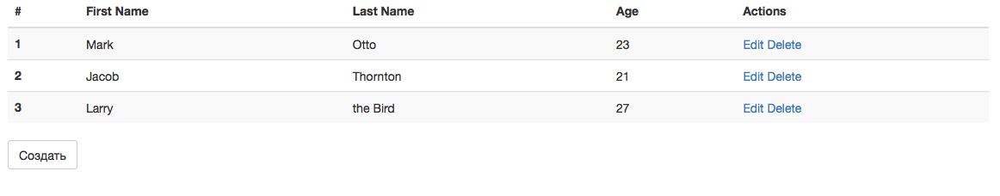
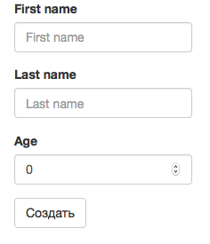

# CRAFT_TEAM_Test_App
## Тестовое задание на должность Frontend Developer
У вас в распоряжении имеется рабочее приложение, осуществляющее CRUD интерфейс для работы с базой сотрудников.
Приложение читает один раз из файла **users.json** и содержит следующую функциональность:
  - список людей
  - создание
  - редактирование
  - удаление
  - фильтрация списка (необязательно)

Список выглядит так




А форма создания пользователя так



Само приложение, как можете заметить, уже реализовано. Ваша задача - переписать приложение, выполнив ряд изменений:
1. Перепишите интерфейс, задействовав библиотеку компонентов material-ui
2. Используйте хуки, вместо текущего подхода
3. Покройте типами приложение typescript
5. Тесты можно не писать

## Установка

```
Скопируйте репозиторий и установите зависимости

$npm install
```

## Запуск

```
npm start
```

## Запуск тестов
```
npm test
```

